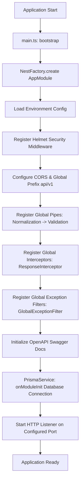
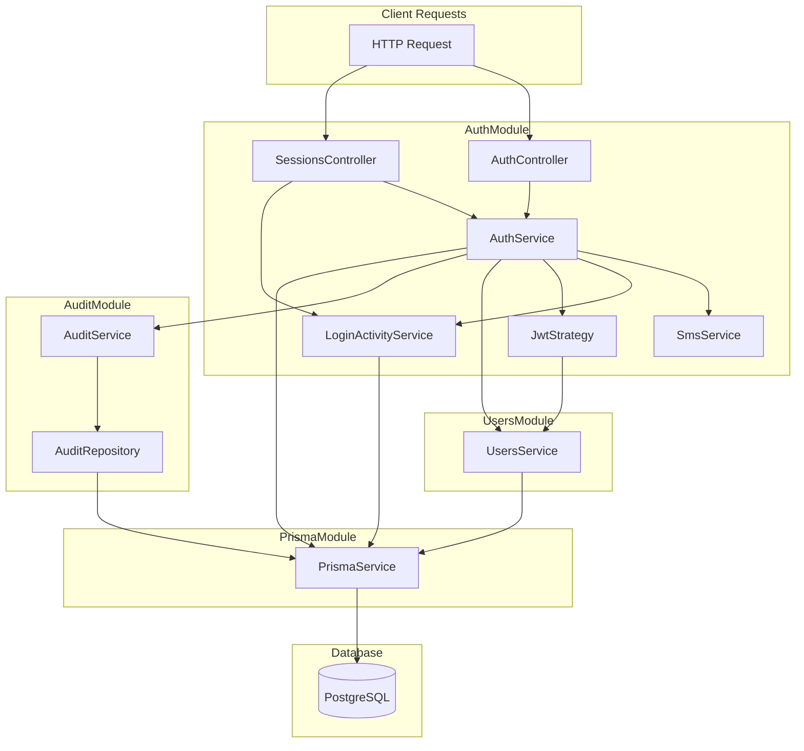
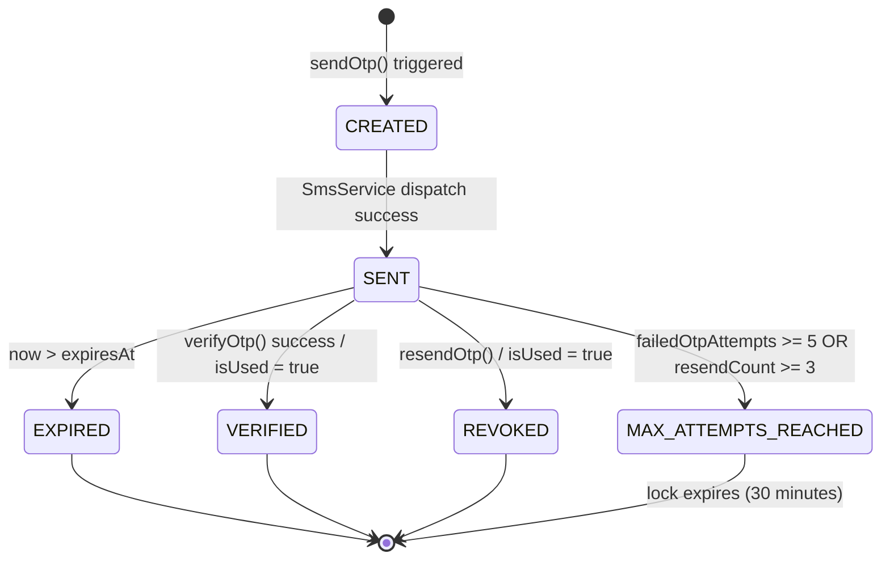
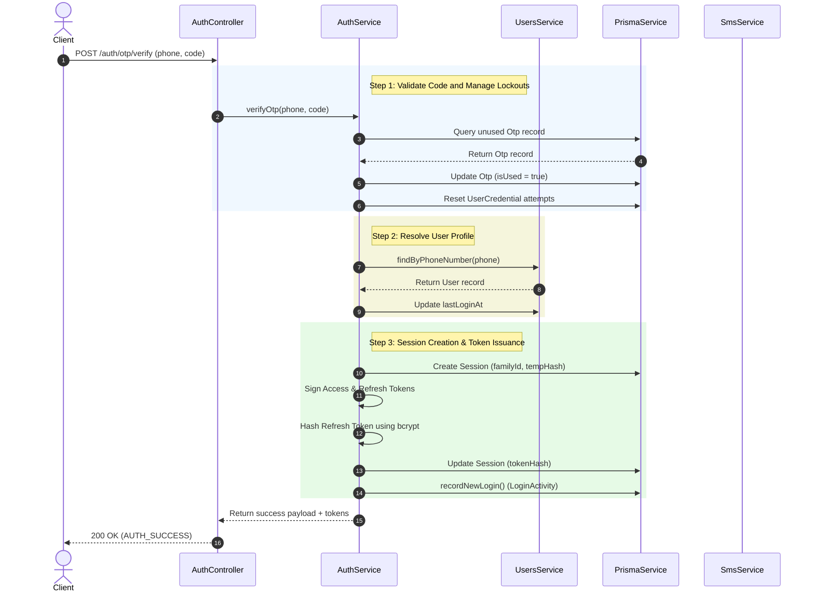
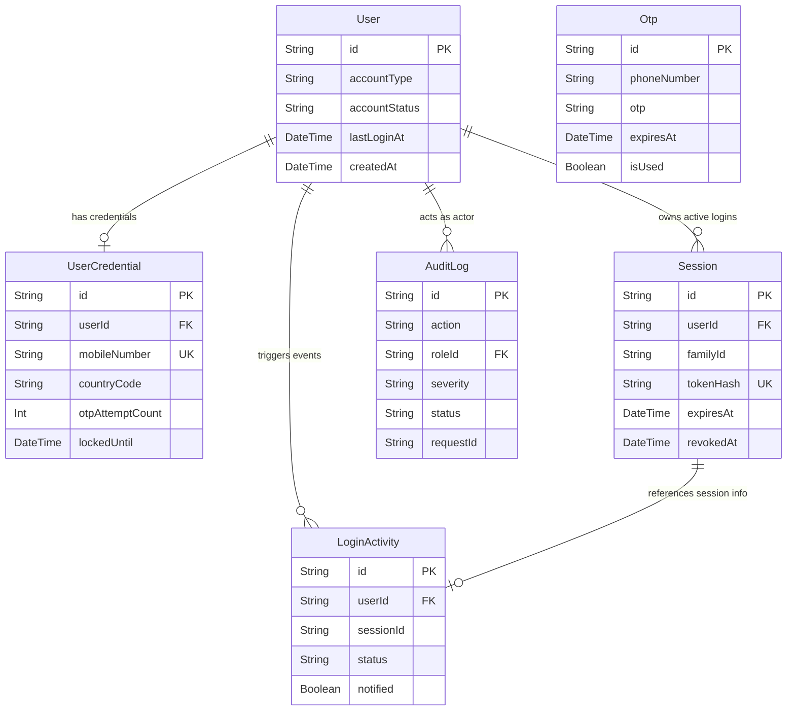

# MaroVarso Server Architecture & Security Documentation

This document provides a comprehensive technical overview of the MaroVarso NestJS backend. It focuses on the internal architecture, bootstrap process, OTP verification lifecycle, JWT-based authentication flow, database schemas, and data transitions.

---

# Section 1: Project Folder Structure Documentation

## 1.1 Application Entry Flow

The entry point of the application is [main.ts](src/main.ts). It is responsible for initializing the NestJS application container, loading environmental configuration, binding global handlers (middlewares, filters, interceptors, and pipes), and spinning up the HTTP server listener.

### Step-by-Step Bootstrap Process

1. **Instantiation**: The entry file calls the [bootstrap()](src/main.ts#L11) function, which starts the NestJS application using `NestFactory.create(AppModule)`.
2. **Environment Loading**: The [AppModule](src/app.module.ts#L20) imports the `ConfigModule` globally, exposing the `ConfigService` to read `.env` configurations (e.g. `PORT`, `NODE_ENV`, `JWT_ACCESS_SECRET`, `CORS_ORIGIN`).
3. **Security Headers**:
   - Integrates the `helmet` middleware globally to set secure HTTP headers.
   - Disables Content Security Policy (CSP) headers inside development (allows interactive Swagger docs) and conditional HSTS headers in production environments.
4. **Prefixing & Versioning**:
   - Sets a global prefix `api` for all routes.
   - Enforces URI versioning with a default fallback to version `1` (yielding `/api/v1/...`).
5. **CORS Management**:
   - Configures Cross-Origin Resource Sharing (CORS) dynamically based on the `CORS_ORIGIN` env value.
   - Allows credential headers (cookies, auth headers) and explicit HTTP methods: `GET,HEAD,PUT,PATCH,POST,DELETE,OPTIONS`.
6. **Global Pipes Registration**:
   - Registers [NormalizationPipe](src/common/pipes/normalization.pipe.ts#L4) to trim whitespaces, lowercase emails, and strip spaces, hyphens, and parentheses from phone numbers.
   - Registers NestJS standard `ValidationPipe` with configuration `{ whitelist: true, transform: true, forbidNonWhitelisted: true }` to enforce class-validator rules on incoming DTOs.
7. **Global Interceptors Registration**:
   - Registers [ResponseInterceptor](src/common/interceptors/response.interceptor.ts#L13) to format successful responses into a standard JSON wrap containing localization checks and correlation tracking metrics.
8. **Global Exception Filters**:
   - Binds [GlobalExceptionFilter](src/common/filters/global-exception.filter.ts#L16) to catch all thrown `HttpException`, Prisma database constraints, or raw JavaScript errors. It formats and translates error messages via `nestjs-i18n` using the client's preferred language.
9. **Logger Initialization**:
   - Uses the built-in `Logger` class from NestJS inside filters and services. Bootstrapping logs standard setup info containing active environment, port, and documentation path.
10. **Swagger OpenAPI Setup**:
    - In non-production environments, configures interactive Swagger docs using `DocumentBuilder`.
    - Exposes the OpenAPI schema and interactive dashboard at `/api/docs` with standard Bearer JWT authorization and `Accept-Language` header overrides.
11. **Listener Binding**:
    - Queries `PORT` (default: 3001) from `ConfigService` and runs `app.listen(port)`.

### Bootstrap Sequence Diagram



---

## 1.2 NestJS Folder Structure

Below is the complete directory structure of the MaroVarso server:

```text
server/
├── prisma/                          # Database declarations & Migrations
│   └── schema.prisma                # Prisma mapping for PostgreSQL
├── src/
│   ├── main.ts                      # App entry point & bootstrapping logic
│   ├── app.module.ts                # Application root module configuring global modules
│   ├── common/                      # Shared assets, utilities, and lifecycle interceptors
│   │   ├── decorators/              # Custom param decorators
│   │   │   └── get-user.decorator.ts # Extracts JWT user payloads from HTTP requests
│   │   ├── exceptions/              # Domain-specific custom exceptions
│   │   │   └── app.exception.ts     # Custom AppException wrapping HTTP status and message keys
│   │   ├── filters/                 # Unified response exception filters
│   │   │   └── global-exception.filter.ts # Translates, logs, and formats error outputs
│   │   ├── guards/                  # Route authorization interceptors
│   │   │   └── jwt-auth.guard.ts    # Enforces Bearer JWT verification
│   │   ├── interceptors/            # Response post-processing pipelines
│   │   │   └── response.interceptor.ts # Formats success payloads and applies translations
│   │   ├── middleware/              # Low-level Express HTTP middlewares
│   │   │   └── request-id.middleware.ts # Injects unique x-request-id for tracing correlation
│   │   └── pipes/                   # Input sanitization and formatting pipes
│   │       └── normalization.pipe.ts # Standardizes phone strings and trims whitespace
│   ├── i18n/                        # Multi-language dictionary files
│   │   ├── en/                      # English error & success key-value pairs
│   │   ├── gu/                      # Gujarati translation dictionary
│   │   └── hi/                      # Hindi translation dictionary
│   └── modules/                     # Domain modules separating logical concerns
│       ├── prisma/                  # Type-safe database connection provider
│       │   ├── prisma.module.ts
│       │   └── prisma.service.ts
│       ├── audit/                   # Security auditing and change log tracking
│       │   ├── audit.module.ts
│       │   ├── audit.repository.ts
│       │   └── audit.service.ts
│       ├── health/                  # Server status monitoring route
│       │   ├── health.module.ts
│       │   └── health.controller.ts
│       ├── users/                   # Profiles and credential administration
│       │   ├── users.module.ts
│       │   └── users.service.ts
│       └── auth/                    # Main OTP generator, SMS adapters, and JWT provider
│           ├── auth.module.ts
│           ├── auth.controller.ts
│           ├── auth.service.ts
│           ├── sessions.controller.ts
│           ├── sms.service.ts
│           ├── cleanup.service.ts
│           ├── login-activity.service.ts
│           ├── dto/                 # Input DTO validators
│           │   ├── send-otp.dto.ts
│           │   ├── verify-otp.dto.ts
│           │   └── refresh-token.dto.ts
│           ├── sms/                 # SMS dispatch adapters
│           │   ├── sms-adapter.interface.ts
│           │   ├── local-sms.adapter.ts
│           │   └── production-sms.adapter.ts
│           └── strategies/          # Passport authentication strategies
│               └── jwt.strategy.ts  # Session-aware access token strategy
```

### Folder Explanations

### `prisma/`
* **Purpose**: Houses database schema definitions and migration configurations.
* **Files**: [schema.prisma](prisma/schema.prisma) mapping models (`User`, `UserCredential`, `Session`, `Otp`, `LoginActivity`, `AuditLog`) to the PostgreSQL database.
* **Dependencies**: Read by Prisma CLI to auto-generate Prisma Client modules.
* **Request Flow**: Static folder; does not intercept runtime HTTP requests directly.

### `src/common/`
* **Purpose**: Holds cross-cutting utilities like custom decorators, exception filters, JWT route guards, response interceptors, validation pipes, and tracing middlewares.
* **Files**: [normalization.pipe.ts](src/common/pipes/normalization.pipe.ts), [global-exception.filter.ts](src/common/filters/global-exception.filter.ts), [response.interceptor.ts](src/common/interceptors/response.interceptor.ts), [jwt-auth.guard.ts](src/common/guards/jwt-auth.guard.ts), [request-id.middleware.ts](src/common/middleware/request-id.middleware.ts).
* **Dependencies**: Imported by [main.ts](src/main.ts) and [app.module.ts](src/app.module.ts) to bind filters globally, and by controllers to guard specific routes.
* **Request Flow**:
  - **Inbound**: Request -> [RequestIdMiddleware](src/common/middleware/request-id.middleware.ts) -> [JwtAuthGuard](src/common/guards/jwt-auth.guard.ts) -> [NormalizationPipe](src/common/pipes/normalization.pipe.ts).
  - **Outbound**: Service Return -> [ResponseInterceptor](src/common/interceptors/response.interceptor.ts) (Success) OR [GlobalExceptionFilter](src/common/filters/global-exception.filter.ts) (Error) -> Client.

### `src/i18n/`
* **Purpose**: Localization dictionaries storing error/success messages in English, Gujarati, and Hindi.
* **Files**: `errors.json` and `success.json` within language folders.
* **Dependencies**: Dynamically read at runtime by the global `I18nModule`.
* **Request Flow**: Evaluated by interceptors and filters when completing requests to inject translated response text.

### `src/modules/prisma/`
* **Purpose**: Wraps and exposes the Prisma client instance.
* **Files**: [prisma.service.ts](src/modules/prisma/prisma.service.ts) and [prisma.module.ts](src/modules/prisma/prisma.module.ts).
* **Dependencies**: Imported by other feature modules (`users`, `auth`, `audit`).
* **Request Flow**: Resolves queries from services and repository classes to read/write records in the PostgreSQL instance.

### `src/modules/audit/`
* **Purpose**: Implements structured system auditing and security logging.
* **Files**: [audit.service.ts](src/modules/audit/audit.service.ts), [audit.repository.ts](src/modules/audit/audit.repository.ts).
* **Dependencies**: Imported by `AuthModule` to record authentication, security abuse, and session activities.
* **Request Flow**: Services invoke `AuditService.log()` asynchronously to write transaction records into the database.

### `src/modules/users/`
* **Purpose**: Manages user entities and credentials database operations.
* **Files**: [users.service.ts](src/modules/users/users.service.ts), [users.module.ts](src/modules/users/users.module.ts).
* **Dependencies**: Imported by `AuthModule` for phone validation and JWT identity validation.
* **Request Flow**: Invoked by auth controllers and JWT passport strategies to query and update active user profiles.

### `src/modules/auth/`
* **Purpose**: Contains the core logic for passwordless logins, OTP management, SMS adapters, token issuance, session rotations, and logout operations.
* **Files**: [auth.controller.ts](src/modules/auth/auth.controller.ts), [auth.service.ts](src/modules/auth/auth.service.ts), [sessions.controller.ts](src/modules/auth/sessions.controller.ts), [sms.service.ts](src/modules/auth/sms.service.ts), [jwt.strategy.ts](src/modules/auth/strategies/jwt.strategy.ts), [login-activity.service.ts](src/modules/auth/login-activity.service.ts).
* **Dependencies**: Imports `UsersModule`, `PrismaModule`, `AuditModule`, `PassportModule`, and `JwtModule`.
* **Request Flow**: Handles client calls to `/auth/otp/*`, `/auth/token/refresh`, `/auth/logout`, `/auth/sessions`, and `/auth/login-activity`.

---

## 1.3 Module-Level Documentation

### 1. PrismaModule
- **Responsibility**: Provides the database connection instance.
- **Services**: [PrismaService](src/modules/prisma/prisma.service.ts#L5) (inherits from `PrismaClient`).
- **Database Models**: Interfaces with all tables in the schema.
- **Dependency Flow**: `PrismaService` is injected into users, auth, and audit modules.

### 2. AuditModule
- **Responsibility**: Records user actions and security alerts (e.g. `OTP_SENT`, `OTP_ABUSE`).
- **Services**: [AuditService](src/modules/audit/audit.service.ts#L37).
- **Repositories**: [AuditRepository](src/modules/audit/audit.repository.ts#L6).
- **Database Models**: Writes to the `AuditLog` table.
- **Dependency Flow**: Injected with `AuditRepository` which calls `PrismaService`.

### 3. HealthModule
- **Responsibility**: Exposes server operational status metrics.
- **Controllers**: [HealthController](src/modules/health/health.controller.ts#L6).
- **Request Flow**: `GET /health` -> [HealthController](src/modules/health/health.controller.ts#L6) -> returns `{ status: "ok" }` directly (bypassing the ResponseInterceptor wrapper).

### 4. UsersModule
- **Responsibility**: Manages database queries for profiles (`User`) and identifiers (`UserCredential`).
- **Services**: [UsersService](src/modules/users/users.service.ts#L8).
- **Database Models**: `User` and `UserCredential` tables.
- **Dependency Flow**: Injected with `PrismaService`. Exposes `UsersService` to `AuthModule`.

### 5. AuthModule
- **Responsibility**: Coordinates the security lifecycle (OTP generation, verification, JWT creation, token rotation, sessions, and logouts).
- **Controllers**:
  - [AuthController](src/modules/auth/auth.controller.ts#L29) (endpoints for OTP and refresh token actions).
  - [SessionsController](src/modules/auth/sessions.controller.ts#L31) (endpoints for session listing and revocation).
- **Services**:
  - [AuthService](src/modules/auth/auth.service.ts#L20) (core login/logout orchestration).
  - [SmsService](src/modules/auth/sms.service.ts#L8) (SMS integration interface).
  - [LoginActivityService](src/modules/auth/login-activity.service.ts#L11) (multi-device notifications).
  - [CleanupService](src/modules/auth/cleanup.service.ts#L7) (daily maintenance cron job).
- **DTOs**: `SendOtpDto`, `VerifyOtpDto`, `RefreshTokenDto`.
- **Guards**: [JwtAuthGuard](src/common/guards/jwt-auth.guard.ts#L5) (binds global JWT validation checks).
- **Strategies**: [JwtStrategy](src/modules/auth/strategies/jwt.strategy.ts#L9) (extracts `sub`/`sid` claims and validates sessions).
- **Database Models**: Reads and writes to `Otp`, `Session`, and `LoginActivity` tables.
- **Dependency Flow**: Injected with `UsersService`, `PrismaService`, `AuditService`, and `JwtService`.

### Module Dependency Flow



---

# Section 2: OTP Verification Flow Documentation

## 2.1 OTP Generation Flow

When a user requests an OTP (`POST /auth/otp/request` or `/auth/otp/resend`), the system validates the request and sends a cryptographically random code.

### Step-by-Step Generation Flow

1. **Submission**: The user submits their `phoneNumber` and `countryCode` inside the request body.
2. **Sanitization**: The [NormalizationPipe](src/common/pipes/normalization.pipe.ts#L4) formats the phone number (removes spaces, hyphens, and brackets) to prevent format bypasses.
3. **Validation**: The `ValidationPipe` validates the fields against `SendOtpDto`.
4. **User Check / Auto-Signup**:
   - The service queries the user credentials table. If the phone number is not found, the system automatically registers a new user (with `accountStatus = 'active'`) and a matching credential record.
5. **Lockout Verification**:
   - Evaluates if the phone number has an active lockout (`lockedUntil > now`).
   - If locked, throws a `400 Bad Request` with an `AUTH_LOCKOUT` code, detailing the remaining lockout minutes.
   - If the lockout duration has passed, resets `failedOtpAttempts` to `0` and `lockedUntil` to `null`.
6. **Rate Limiting & Abuse Detection**:
   - Counts OTP records created for this phone number in the last 10 minutes.
   - If the count is $\ge 5$, the system logs a high-severity `OTP_ABUSE` event in the audit logs and throws an `AUTH_EXCESSIVE_REQUESTS` error.
7. **Cooldown Check**:
   - Queries the latest active (unused and unexpired) OTP. If the elapsed time since its creation is less than `OTP_COOLDOWN_SECONDS` (default: 30 seconds), throws `AUTH_OTP_COOLDOWN` (or `AUTH_OTP_RESEND_COOLDOWN` for resends).
8. **Invalidate Old Code**:
   - If the cooldown is met, the previous active OTP record is marked as used (`isUsed = true`) to prevent concurrent validation of multiple codes.
9. **Resend Constraints (For `/resend` requests)**:
   - If the active OTP's `resendCount` is $\ge 3$, the system locks the account for 30 minutes, writes an `OTP_ABUSE` security log, and throws `AUTH_MAX_RESEND_EXCEEDED`.
10. **Code Generation**:
    - Generates a 6-digit numeric OTP using `crypto.randomInt(100000, 1000000).toString()`.
11. **Persistence**:
    - Computes expiration time: current time + `OTP_EXPIRATION_MINUTES` (default: 5 minutes).
    - Saves the new transaction record in the `Otp` table with `isUsed = false`. If this is a resend, the `resendCount` is incremented.
12. **SMS Dispatch**:
    - Calls [SmsService](src/modules/auth/sms.service.ts#L8) to send the OTP.
    - If the environment provider is configured as `local`, it logs a warning box containing the OTP to the developer console. If in production, it routes the message through the configured SMS gateway.
13. **Audit Log**:
    - Writes an `OTP_SENT` (or `OTP_RESENT`) record with status `SUCCESS` to the `AuditLog` table.
14. **Response**:
    - Returns a success response wrapping `AUTH_OTP_SENT` (or `AUTH_OTP_RESENT`).

---

## 2.2 OTP Verification Flow

When a client submits a verification request (`POST /auth/otp/verify`):

1. **Submission**: The user submits their `phoneNumber`, `countryCode`, and the `otp` code.
2. **Lockout Check**: Verifies that the phone number is not currently locked out.
3. **Database Query**:
   - Looks up an active, unused (`isUsed = false`) OTP record matching the phone number and submitted code, ordered by creation date descending.
4. **Validation**:
   - **Verification Failed**: If no matching record is found, or the current time has passed the OTP's `expiresAt` timestamp:
     - Increments the `otpAttemptCount` inside the `UserCredential` table.
     - Writes an `OTP_VERIFICATION_FAILED` audit log.
     - If the new attempt count reaches $\ge 5$, sets `lockedUntil` to `now + 30 minutes`, records an `OTP_ABUSE` security event, and throws `AUTH_MAX_VERIFY_EXCEEDED`.
     - Otherwise, throws `AUTH_INVALID_OTP` (if missing/incorrect) or `AUTH_OTP_EXPIRED` (if expired).
5. **Success Cleanup**:
   - Marks the matched OTP as used (`isUsed = true`).
   - Resets lockout counters on the user's credentials (`otpAttemptCount = 0`, `lockedUntil = null`).
6. **Profile Update**:
   - Checks if the user has logged in before. If `lastLoginAt` is null, sets `isNewUser = true`.
   - Updates `lastLoginAt` to the current timestamp.
7. **Session Setup**:
   - Generates a unique `familyId` UUID for token rotation tracking.
   - Computes session expiration based on `JWT_REFRESH_EXPIRATION` (default: 30 days).
   - Inserts a new session record in the `Session` table with a temporary token hash.
   - Signs the JWT Access Token and Refresh Token (both containing `{ sub: userId, sid: sessionId }`).
   - Hashes the Refresh Token using `bcrypt` and writes it to the session record's `tokenHash`.
8. **Login Activity**:
   - Calls [LoginActivityService.recordNewLogin()](src/modules/auth/login-activity.service.ts#L17) to log a new session activity if the user already has other active sessions.
9. **Audit Log**:
    - Writes `OTP_VERIFIED` and `USER_LOGIN` logs to the database with status `SUCCESS`.
10. **Response**:
    - Returns a success response containing the access and refresh tokens, user metadata, and `isNewUser` flag.

---

## 2.3 OTP Failure Scenarios

| Failure Scenario | Condition / Validation | Error Code | HTTP Status | Action taken / Expected Behavior |
| :--- | :--- | :--- | :--- | :--- |
| **Invalid OTP** | OTP submitted does not match the active DB record. | `AUTH_INVALID_OTP` | `400 Bad Request` | Increments `otpAttemptCount` by 1. Logs `OTP_VERIFICATION_FAILED`. |
| **Expired OTP** | OTP submitted matches but the current time has passed `expiresAt`. | `AUTH_OTP_EXPIRED` | `400 Bad Request` | Increments `otpAttemptCount` by 1. Logs `OTP_VERIFICATION_FAILED`. |
| **Max Attempts Reached** | Credential `otpAttemptCount` is $\ge 5$ during verification. | `AUTH_MAX_VERIFY_EXCEEDED` | `400 Bad Request` | Sets `lockedUntil = now + 30 minutes`. Writes `OTP_ABUSE` security audit log. |
| **User Not Found** | No `User` record exists for the submitted phone number. | None (Auto-Signup) | `200 OK` (on success) | Handled gracefully: the server automatically calls `UsersService.create()` to provision a new profile. |
| **OTP Already Used** | Code submitted matches but `isUsed = true`. | `AUTH_INVALID_OTP` | `400 Bad Request` | Treated as invalid. Increments `otpAttemptCount`. |
| **OTP Resend Cooldown** | OTP resend requested before the 30-second cooldown expires. | `AUTH_OTP_RESEND_COOLDOWN` | `400 Bad Request` | Blocks generation. Returns remaining cooldown seconds. |
| **Max Resend Reached** | Resend requested when `resendCount` is $\ge 3$. | `AUTH_MAX_RESEND_EXCEEDED` | `400 Bad Request` | Sets `lockedUntil = now + 30 minutes`. Writes `OTP_ABUSE` security audit log. |
| **Multiple OTP Requests** | More than 5 OTP requests made within a 10-minute window. | `AUTH_EXCESSIVE_REQUESTS` | `400 Bad Request` | Writes `OTP_ABUSE` security audit log with severity `HIGH`. |
| **Concurrent Verifications** | Two requests verifying the same OTP simultaneously. | `AUTH_INVALID_OTP` | `400 Bad Request` (for the losing request) | The first request atomically updates `isUsed = true`. The second request fails to find the unused OTP and fails. |

---

## 2.4 OTP State Transitions



- **Transition Rules**:
  - `CREATED -> SENT`: Happens when the SMS adapter processes the dispatch.
  - `SENT -> VERIFIED`: Triggered when the user submits the correct code within the expiration window. The system sets `isUsed = true`.
  - `SENT -> EXPIRED`: Occurs when the verification window passes `expiresAt` (default: 5 minutes) without a successful validation.
  - `SENT -> REVOKED`: Occurs when a user successfully requests a resend after the 30-second cooldown. The previous OTP record is marked as used.
  - `SENT -> MAX_ATTEMPTS_REACHED`: Triggered if 5 incorrect verification attempts are made, or 3 resends are requested for the same transaction. The credential is locked for 30 minutes.

---

# Section 3: JWT Authentication Flow Documentation

## 3.1 Login Flow



---

## 3.2 Access Token Flow

Protected routes are guarded by the [JwtAuthGuard](src/common/guards/jwt-auth.guard.ts#L5) and processed by the [JwtStrategy](src/modules/auth/strategies/jwt.strategy.ts#L9).

```mermaid
graph TD
    Req[Incoming HTTP Request] --> G[JwtAuthGuard]
    G --> V[Passport JWT Verification]
    V -- Signature Invalid / Expired? --> Err[Throw AUTH_TOKEN_EXPIRED / AUTH_UNAUTHORIZED]
    V -- Decrypted Payload --> S[JwtStrategy: validate]
    S --> U[UsersService: findById sub]
    U -- User inactive? --> Err
    U -- Active User --> DB[Prisma: Find unique Session sid]
    DB -- Session missing / expired? --> Err
    DB -- Session revoked? --> L{Is route /logout?}
    L -- No --> Err
    L -- Yes --> Bypass[Allow strategy to resolve]
    DB -- Session valid --> Attach[Attach User & sessionId to req.user]
    Attach --> Exec[Execute Controller Method]
```



* **Secret Verification**: passport-jwt decrypts and validates the signature using the `JWT_ACCESS_SECRET`.
* **Expiry Validation**: Checks the token expiration claim (`exp`). If expired, `JwtAuthGuard` catches `TokenExpiredError` and throws `AUTH_TOKEN_EXPIRED` (HTTP 401).
* **Signature & Payload Validation**:
  - Extracts the subject `sub` (userId) and session ID `sid`.
  - Checks if the user exists and their `accountStatus` is `active`.
  - Queries the database to verify the session `sid` exists, matches the user ID, and `expiresAt` is in the future.
  - If `session.revokedAt` is not null, the request is rejected with `AUTH_UNAUTHORIZED` unless the request is hitting the logout route (to handle graceful cleanups).

---

## 3.3 Refresh Token Flow

The system implements Refresh Token Rotation (RTR) to maintain security for long-lived sessions.

### Step-by-Step Refresh Flow

1. **Request**: The client submits a `refreshToken` to `/auth/token/refresh`.
2. **Signature Verification**: The [AuthService](src/modules/auth/auth.service.ts#L20) verifies the token signature using the `JWT_REFRESH_SECRET`.
3. **Payload Extraction**: Extracts the `sub` (userId) and `sid` (sessionId) claims.
4. **Session Verification**:
   - Queries the database for the session.
   - If the session does not exist, or the user ID does not match, throws `AUTH_UNAUTHORIZED`.
5. **Token Reuse Detection (RFC 9700)**:
   - **Scenario**: If a refresh token is submitted but the session record has already been marked revoked (`revokedAt !== null`), it indicates a potential token theft.
   - **Mitigation**: The system immediately revokes all active sessions for the user:
     ```typescript
     await this.prisma.session.updateMany({
       where: { userId, revokedAt: null },
       data: { revokedAt: now },
     });
     ```
   - Logs a critical security audit event (`TOKEN_REUSE_DETECTED`) with `CRITICAL` severity and throws `AUTH_SESSION_COMPROMISED` (HTTP 401).
6. **Hash Matching**:
   - Compares the submitted raw refresh token with the stored bcrypt hash (`session.tokenHash`) using `bcrypt.compare`.
   - If they do not match, throws `AUTH_UNAUTHORIZED`.
7. **Rotation Transaction**:
   - Executes a database transaction (`prisma.$transaction`) to:
     1. Create a new session record under the same `familyId` chain with a temporary hash placeholder.
     2. Revoke the old session by setting `revokedAt = now` and `replacedBy = newSessionId`.
8. **Token Re-issuance**:
   - Signs a new Access Token and a new Refresh Token carrying the new session ID.
   - Hashes the new Refresh Token and updates the new session's `tokenHash` field.
   - Logs a `TOKEN_REFRESH` event in the audit log.
   - Returns the new token pair to the client.

### Security Design & DoS Prevention (Hash Mismatch vs. Reuse)

> [!NOTE]
> There is an intentional security design choice in how **Hash Mismatch** vs. **Session Revoked (Token Reuse)** is handled:
>
> 1. **Session Revoked (Token Reuse)**: If a refresh token is verified but its corresponding session is *already* revoked (`revokedAt !== null`), the system triggers **global session revocation** (marks all active user sessions as revoked), logs a `TOKEN_REUSE_DETECTED` event, and throws `AUTH_SESSION_COMPROMISED`. This is in compliance with **RFC 9700** and defends against token theft by locking down the account when a rotated token is leaked and used a second time.
> 2. **Hash Mismatch**: If the refresh token signature is valid and the session exists/is not revoked, but the raw token's hash does not match `session.tokenHash` via `bcrypt.compare`, the system merely throws `AUTH_UNAUTHORIZED`. It does **not** revoke other sessions. This prevents a **Denial of Service (DoS) vulnerability** where an attacker could repeatedly guess session IDs (`sid`) and send arbitrary tokens to force logout legitimate users.

---

## 3.4 Logout Flow

Logs out the user by invalidating their active session.

### Step-by-Step Logout Flow

1. **Request**: The client sends a `POST /auth/logout` request containing their Bearer Access Token.
2. **Authentication**: The route guard extracts the validated session ID (`sessionId`) and user ID (`userId`) from the token.
3. **Session Update**:
   - Locates the session record. If found and not already revoked, sets `revokedAt = now`.
4. **Audit Log**:
   - Writes a `USER_LOGOUT` audit log. If the session was already revoked, logs that the user is already logged out.
5. **Response**:
   - Returns a success response: `LOGOUT_SUCCESS` (if successfully revoked) or `ALREADY_LOGGED_OUT` (if previously revoked).

### Logout Edge Cases

* **Logout Once**: Revokes the active session and returns `LOGOUT_SUCCESS`.
* **Logout Twice**: The second request contains a token linked to a revoked session. Because [JwtStrategy](src/modules/auth/strategies/jwt.strategy.ts#L56) allows revoked sessions for the logout route, the request is authenticated. The service detects `session.revokedAt !== null` and returns `ALREADY_LOGGED_OUT` without changing the database.
* **Concurrent Logouts**: If two logout requests are processed concurrently, the database updates `revokedAt` on the first write. The second write updates the field with the same timestamp, and both return successfully.
* **Expired Refresh Token**: If the refresh token has expired, it does not affect the logout route because the logout endpoint only requires validation of the short-lived Access Token.
* **Missing Refresh Token**: The logout endpoint does not require the refresh token to invalidate the session in the database.
* **Access Token Expired During Logout**: If the Access Token has expired, the request is blocked by `JwtAuthGuard` before reaching the controller. The client must either refresh the token first or discard the local tokens to prompt a re-login.

---

## 3.5 JWT Failure Scenarios

| Failure Scenario | Validation Step | Error Code | HTTP Response | Security Reason / Rationale |
| :--- | :--- | :--- | :--- | :--- |
| **Invalid Token** | Passport signature validation fails. | `AUTH_UNAUTHORIZED` | `401 Unauthorized` | Rejects malformed tokens or tokens signed with incorrect keys. |
| **Expired Access Token** | Passport checks the `exp` claim. | `AUTH_TOKEN_EXPIRED` | `401 Unauthorized` | Limits the lifecycle of stolen access tokens. |
| **Tampered Token** | JWT signature verification fails. | `AUTH_UNAUTHORIZED` | `401 Unauthorized` | Prevents privilege escalation and payload tampering. |
| **Missing Token** | Guard checks the `Authorization` header. | `AUTH_UNAUTHORIZED` | `401 Unauthorized` | Blocks unauthenticated access to protected resources. |
| **Session Not Found** | Strategy queries the `Session` table using `sid`. | `AUTH_UNAUTHORIZED` | `401 Unauthorized` | Blocks requests if the session record has been deleted by cleanup tasks. |
| **Session Revoked** | Strategy verifies `session.revokedAt === null`. | `AUTH_UNAUTHORIZED` | `401 Unauthorized` | Invalidates tokens immediately after logout or token compromise. |
| **Refresh Token Mismatch** | `bcrypt.compare` fails against `session.tokenHash`. | `AUTH_UNAUTHORIZED` | `401 Unauthorized` | Rejects invalid tokens generated outside the rotation chain. |
| **Refresh Token Reuse** | Refresh flow detects `session.revokedAt !== null`. | `AUTH_SESSION_COMPROMISED` | `401 Unauthorized` | Mitigates token theft by invalidating all active sessions for the user. |

---

## 3.6 Session Management

The system tracks active sessions in the database to control token lifecycles and detect suspicious activity:

* **Creation**: Created in the database upon successful OTP verification. Stores client details (user agent, IP address), expiration date, and a rotation chain identifier (`familyId`).
* **Update / Rotation**: On refresh, the existing session is revoked and linked to a newly created session record in the database.
* **Expiration**: Computed when tokens are issued. Scheduled cleanup tasks delete sessions that have passed their expiration date.
* **Revocation**: Triggered by user logout, session termination, or token reuse detection.
* **Device & Client Tracking**:
  - **IP and Device Tracking**: Reads client headers (`user-agent` and `x-forwarded-for`/`ip`) to log the client's location and device type.
  - **Multi-Device Detection**: On successful login, the system counts other active sessions for the user. If active sessions exist, it writes a record to the `LoginActivity` table. The user can view these events and mark suspicious logins, which revokes the corresponding session.

---

# Section 4: Database Flow Documentation

## 4.1 Authentication Tables

```text
  +-------------------+        +----------------------+
  |       users       |        |   user_credentials   |
  |-------------------|        |----------------------|
  | id (PK) (UUID)    |<-------| id (PK) (UUID)       |
  | account_type      |        | user_id (FK, Unique) |
  | account_status    |        | mobile_number(Unique)|
  | last_login_at     |        | country_code         |
  | created_at        |        | otp_attempt_count    |
  | updated_at        |        | locked_until         |
  +-------------------+        +----------------------+
          |
          |---------------------------+
          |                           |
          v                           v
  +-------------------+        +----------------------+
  |     sessions      |        |   login_activities   |
  |-------------------|        |----------------------|
  | id (PK) (UUID)    |        | id (PK) (UUID)       |
  | user_id (FK)      |        | user_id (FK)         |
  | family_id         |        | session_id           |
  | token_hash(Unique)|        | device_info          |
  | expires_at        |        | ip_address           |
  | revoked_at        |        | status               |
  +-------------------+        +----------------------+
```

### 1. `users` Table
* **Purpose**: Stores the core identity for users.
* **Columns**:
  - `id`: UUID (Primary Key).
  - `account_type`: string (`individual`, `guardian`, `admin`, default: `individual`).
  - `account_status`: string (`active`, `suspended`, `deleted`, default: `active`).
  - `preferred_language`: string (nullable).
  - `timezone`: string (nullable).
  - `last_login_at`: DateTime (nullable).
  - `failed_login_count`: integer (default: 0).
  - `created_at`: DateTime.
  - `updated_at`: DateTime.
  - `deleted_at`: DateTime (nullable, soft-delete).
* **Constraints**: Primary key on `id`.
* **Indexes**: Index on `account_status`, Index on `created_at`.
* **Relationships**:
  - Has-One `UserCredential` (relation on `userId`).
  - Has-Many `Session` (relation on `userId`).
  - Has-Many `LoginActivity` (relation on `userId`).

### 2. `user_credentials` Table
* **Purpose**: Stores login credentials, identifiers, and OTP lockout state.
* **Columns**:
  - `id`: UUID (Primary Key).
  - `user_id`: UUID (Foreign Key, Unique).
  - `mobile_number`: string (Unique).
  - `country_code`: string.
  - `email`: string (Unique, nullable).
  - `mpin_hash`: string (nullable).
  - `two_factor_enabled`: boolean (default: false).
  - `otp_attempt_count`: integer (default: 0).
  - `otp_last_sent_at`: DateTime (nullable).
  - `locked_until`: DateTime (nullable).
  - `created_at`: DateTime.
* **Constraints**: Unique constraint on `mobile_number` and `email`. Foreign key `user_id` references `users.id` with cascade deletion.
* **Indexes**: Index on `mobile_number`, Index on `email`.

### 3. `sessions` Table
* **Purpose**: Tracks active login sessions and handles refresh token rotations.
* **Columns**:
  - `id`: UUID (Primary Key).
  - `user_id`: UUID (Foreign Key).
  - `family_id`: UUID (Token rotation chain grouping).
  - `token_hash`: string (Unique bcrypt hash of the Refresh Token).
  - `device_info`: string (nullable User-Agent).
  - `login_ip`: string (nullable IP address).
  - `login_at`: DateTime.
  - `expires_at`: DateTime.
  - `revoked_at`: DateTime (nullable).
  - `replaced_by`: UUID (nullable reference to replacing session ID).
* **Constraints**: Unique constraint on `token_hash`. Foreign key `user_id` references `users.id` with cascade deletion.
* **Indexes**: Index on `user_id`, Index on `expires_at`, Index on `family_id`.

### 4. `otps` Table
* **Purpose**: Records verification codes and OTP transactions.
* **Columns**:
  - `id`: UUID (Primary Key).
  - `phone_number`: string.
  - `otp`: string.
  - `expires_at`: DateTime.
  - `is_used`: boolean (default: false).
  - `resend_count`: integer (default: 0).
  - `created_at`: DateTime.
* **Constraints**: Primary key on `id`.
* **Indexes**: Index on `phone_number` and `is_used` (composite index for active code lookups).

### 5. `login_activities` Table
* **Purpose**: Logs login attempts and tracks device metadata.
* **Columns**:
  - `id`: UUID (Primary Key).
  - `user_id`: UUID (Foreign Key).
  - `device_info`: string (nullable).
  - `ip_address`: string (nullable).
  - `status`: string (`trusted`, `suspicious`, `blocked`, default: `trusted`).
  - `notified`: boolean (default: false).
  - `session_id`: string (nullable).
  - `created_at`: DateTime.
* **Constraints**: Foreign key `user_id` references `users.id` with cascade deletion.
* **Indexes**: Index on `user_id`.

### 6. `audit_logs` Table
* **Purpose**: Tracks system-wide events and administrative changes for auditing.
* **Columns**:
  - `id`: UUID (Primary Key).
  - `action`: string (e.g., `OTP_SENT`, `USER_LOGIN`, `TOKEN_REUSE_DETECTED`).
  - `entity_type`: string (nullable).
  - `entity_id`: string (nullable).
  - `role_id`: string (nullable user or system ID).
  - `role_type`: string (nullable role type).
  - `previous_state`: Json (nullable).
  - `current_state`: Json (nullable).
  - `description`: string (nullable).
  - `severity`: string (nullable, e.g. `LOW`, `HIGH`, `CRITICAL`).
  - `status`: string (nullable, e.g. `SUCCESS`, `FAILED`).
  - `request_id`: string (nullable correlation ID).
  - `ip_address`: string (nullable).
  - `user_agent`: string (nullable).
  - `metadata`: Json (nullable).
  - `created_at`: DateTime.
* **Indexes**: Index on `action`, Index on `role_id`, Index on `entity_type` + `entity_id`, Index on `created_at`.

---

## 4.2 Authentication Database Flow

During authentication and session lifecycle operations, the database executes read and write operations in the following order:

```mermaid
graph TD
    subgraph OTP Request
        A[Check Credentials Lockout] -->|Read| UCR[user_credentials]
        B[Abuse Detection Count] -->|Read| OTPR[otps]
        C[Update Old OTP as Used] -->|Write| OTPU[otps]
        D[Insert New OTP Record] -->|Write| OTPI[otps]
        E[Write Action Log] -->|Write| AUDI[audit_logs]
    end
    subgraph OTP Verification
        F[Check Credentials Lockout] -->|Read| UCR
        G[Find Match and Verify] -->|Read| OTPR
        H[Lockout increment or reset] -->|Write| UCR
        I[Mark OTP Code Used] -->|Write| OTPU
        J[Resolve / Auto-Signup User] -->|Write| USRI[users]
        K[Insert Session Record] -->|Write| SESI[sessions]
        L[Record Login Activity] -->|Write| LAI[login_activities]
        M[Write Login Logs] -->|Write| AUDI
    end
```



---

## 4.3 Database Relationship Diagram



---

# Section 5: Draw.io XML Generation

The following XML blocks can be imported directly into [Draw.io](https://app.diagrams.net/) (File -> Import From -> XML) to load the corresponding workflow diagrams.

## Diagram 1: Application Bootstrap Flow

```xml
<mxfile host="Electron" modified="2026-06-12T00:00:00.000Z" agent="MaroVarso Diagram Builder" version="21.0.0" type="device">
  <diagram id="bootstrap-flow-diagram" name="Application Bootstrap Flow">
    <mxGraphModel dx="1200" dy="800" grid="1" gridSize="10" guides="1" tooltips="1" connect="1" arrows="1" fold="1" page="1" pageScale="1" pageWidth="827" pageHeight="1169" math="0" shadow="0">
      <root>
        <mxCell id="0" />
        <mxCell id="1" parent="0" />
        
        <mxCell id="n1" value="Start Bootstrap" style="ellipse;whiteSpace=wrap;html=1;fillColor=#dae8fc;strokeColor=#6c8ebf;fontStyle=1;fontSize=12;" vertex="1" parent="1">
          <mxGeometry x="120" y="40" width="140" height="50" as="geometry" />
        </mxCell>
        
        <mxCell id="n2" value="main.ts&#xa;(bootstrap method)" style="rounded=1;whiteSpace=wrap;html=1;fillColor=#fff2cc;strokeColor=#d6b656;fontSize=12;" vertex="1" parent="1">
          <mxGeometry x="120" y="130" width="140" height="60" as="geometry" />
        </mxCell>
        
        <mxCell id="n3" value="AppModule Loading&#xa;(Register Config, Throttler, i18n)" style="rounded=1;whiteSpace=wrap;html=1;fillColor=#d5e8d4;strokeColor=#82b366;fontSize=12;" vertex="1" parent="1">
          <mxGeometry x="110" y="230" width="160" height="60" as="geometry" />
        </mxCell>
        
        <mxCell id="n4" value="Register Global Providers&#xa;(Pipes, Filters, Interceptors)" style="rounded=1;whiteSpace=wrap;html=1;fillColor=#e1d5e7;strokeColor=#9673a6;fontSize=12;" vertex="1" parent="1">
          <mxGeometry x="110" y="330" width="160" height="60" as="geometry" />
        </mxCell>
        
        <mxCell id="n5" value="PrismaService&#xa;(onModuleInit connection)" style="rounded=1;whiteSpace=wrap;html=1;fillColor=#ffe6cc;strokeColor=#d79b00;fontSize=12;" vertex="1" parent="1">
          <mxGeometry x="120" y="430" width="140" height="60" as="geometry" />
        </mxCell>
        
        <mxCell id="n6" value="Server Ready&#xa;(HTTP Server Listening)" style="ellipse;whiteSpace=wrap;html=1;fillColor=#d5e8d4;strokeColor=#82b366;fontStyle=1;fontSize=12;" vertex="1" parent="1">
          <mxGeometry x="120" y="530" width="140" height="60" as="geometry" />
        </mxCell>
        
        <mxCell id="e1" style="edgeStyle=orthogonalEdgeStyle;rounded=0;html=1;exitX=0.5;exitY=1;exitDx=0;exitDy=0;entryX=0.5;entryY=0;entryDx=0;entryDy=0;" edge="1" source="n1" target="n2" parent="1">
          <mxGeometry relative="1" as="geometry" />
        </mxCell>
        
        <mxCell id="e2" style="edgeStyle=orthogonalEdgeStyle;rounded=0;html=1;exitX=0.5;exitY=1;exitDx=0;exitDy=0;entryX=0.5;entryY=0;entryDx=0;entryDy=0;" edge="1" source="n2" target="n3" parent="1">
          <mxGeometry relative="1" as="geometry" />
        </mxCell>
        
        <mxCell id="e3" style="edgeStyle=orthogonalEdgeStyle;rounded=0;html=1;exitX=0.5;exitY=1;exitDx=0;exitDy=0;entryX=0.5;entryY=0;entryDx=0;entryDy=0;" edge="1" source="n3" target="n4" parent="1">
          <mxGeometry relative="1" as="geometry" />
        </mxCell>
        
        <mxCell id="e4" style="edgeStyle=orthogonalEdgeStyle;rounded=0;html=1;exitX=0.5;exitY=1;exitDx=0;exitDy=0;entryX=0.5;entryY=0;entryDx=0;entryDy=0;" edge="1" source="n4" target="n5" parent="1">
          <mxGeometry relative="1" as="geometry" />
        </mxCell>
        
        <mxCell id="e5" style="edgeStyle=orthogonalEdgeStyle;rounded=0;html=1;exitX=0.5;exitY=1;exitDx=0;exitDy=0;entryX=0.5;entryY=0;entryDx=0;entryDy=0;" edge="1" source="n5" target="n6" parent="1">
          <mxGeometry relative="1" as="geometry" />
        </mxCell>
      </root>
    </mxGraphModel>
  </diagram>
</mxfile>
```

---

## Diagram 2: OTP Verification Flow

```xml
<mxfile host="Electron" modified="2026-06-12T00:00:00.000Z" agent="MaroVarso Diagram Builder" version="21.0.0" type="device">
  <diagram id="otp-verification-flowchart" name="OTP Verification flowchart">
    <mxGraphModel dx="1200" dy="800" grid="1" gridSize="10" guides="1" tooltips="1" connect="1" arrows="1" fold="1" page="1" pageScale="1" pageWidth="827" pageHeight="1169" math="0" shadow="0">
      <root>
        <mxCell id="0" />
        <mxCell id="1" parent="0" />
        
        <mxCell id="v1" value="OTP Verify Request&#xa;(phone, code)" style="ellipse;whiteSpace=wrap;html=1;fillColor=#dae8fc;strokeColor=#6c8ebf;fontStyle=1;" vertex="1" parent="1">
          <mxGeometry x="160" y="40" width="160" height="50" as="geometry" />
        </mxCell>
        
        <mxCell id="v2" value="Is Phone Locked?&#xa;(lockedUntil &gt; now)" style="rhombus;whiteSpace=wrap;html=1;fillColor=#fff2cc;strokeColor=#d6b656;" vertex="1" parent="1">
          <mxGeometry x="140" y="130" width="200" height="90" as="geometry" />
        </mxCell>
        
        <mxCell id="v3" value="Throw AUTH_LOCKOUT&#xa;(Lockout active)" style="rounded=1;whiteSpace=wrap;html=1;fillColor=#f8cecc;strokeColor=#b85450;" vertex="1" parent="1">
          <mxGeometry x="400" y="150" width="160" height="50" as="geometry" />
        </mxCell>
        
        <mxCell id="v4" value="Find matching unused OTP&#xa;(otp = code, isUsed = false)" style="rhombus;whiteSpace=wrap;html=1;fillColor=#fff2cc;strokeColor=#d6b656;" vertex="1" parent="1">
          <mxGeometry x="140" y="260" width="200" height="100" as="geometry" />
        </mxCell>
        
        <mxCell id="v5" value="Increment otpAttemptCount&#xa;Is count &gt;= 5?" style="rhombus;whiteSpace=wrap;html=1;fillColor=#fff2cc;strokeColor=#d6b656;" vertex="1" parent="1">
          <mxGeometry x="400" y="260" width="160" height="100" as="geometry" />
        </mxCell>
        
        <mxCell id="v6" value="Set lockedUntil = now + 30m&#xa;Log OTP_ABUSE event&#xa;Throw AUTH_MAX_VERIFY" style="rounded=1;whiteSpace=wrap;html=1;fillColor=#f8cecc;strokeColor=#b85450;" vertex="1" parent="1">
          <mxGeometry x="610" y="285" width="190" height="55" as="geometry" />
        </mxCell>
        
        <mxCell id="v7" value="Throw AUTH_INVALID_OTP&#xa;or AUTH_OTP_EXPIRED" style="rounded=1;whiteSpace=wrap;html=1;fillColor=#f8cecc;strokeColor=#b85450;" vertex="1" parent="1">
          <mxGeometry x="400" y="400" width="160" height="50" as="geometry" />
        </mxCell>
        
        <mxCell id="v8" value="Mark OTP as used&#xa;Reset lockout counters" style="rounded=1;whiteSpace=wrap;html=1;fillColor=#d5e8d4;strokeColor=#82b366;" vertex="1" parent="1">
          <mxGeometry x="160" y="400" width="160" height="50" as="geometry" />
        </mxCell>
        
        <mxCell id="v9" value="Generate Session&#xa;Create Tokens&#xa;Log Success" style="rounded=1;whiteSpace=wrap;html=1;fillColor=#d5e8d4;strokeColor=#82b366;fontStyle=1;" vertex="1" parent="1">
          <mxGeometry x="160" y="490" width="160" height="60" as="geometry" />
        </mxCell>
        
        <mxCell id="v10" value="User Clicks Resend OTP" style="rounded=1;whiteSpace=wrap;html=1;fillColor=#dae8fc;strokeColor=#6c8ebf;" vertex="1" parent="1">
          <mxGeometry x="400" y="490" width="160" height="50" as="geometry" />
        </mxCell>
        
        <mxCell id="v11" value="Increment Resend Count" style="rounded=1;whiteSpace=wrap;html=1;fillColor=#f5f5f5;strokeColor=#ccc;" vertex="1" parent="1">
          <mxGeometry x="400" y="580" width="160" height="50" as="geometry" />
        </mxCell>
        
        <mxCell id="v12" value="Resend Count &gt;= 3?" style="rhombus;whiteSpace=wrap;html=1;fillColor=#fff2cc;strokeColor=#d6b656;" vertex="1" parent="1">
          <mxGeometry x="380" y="670" width="200" height="90" as="geometry" />
        </mxCell>
        
        <mxCell id="v13" value="Lock Account 30 Minutes" style="rounded=1;whiteSpace=wrap;html=1;fillColor=#f8cecc;strokeColor=#b85450;" vertex="1" parent="1">
          <mxGeometry x="290" y="800" width="160" height="50" as="geometry" />
        </mxCell>
        
        <mxCell id="v14" value="MAX_RESEND_EXCEEDED" style="rounded=1;whiteSpace=wrap;html=1;fillColor=#f8cecc;strokeColor=#b85450;fontStyle=1;" vertex="1" parent="1">
          <mxGeometry x="290" y="890" width="160" height="50" as="geometry" />
        </mxCell>
        
        <mxCell id="v15" value="Invalidate Old OTP" style="rounded=1;whiteSpace=wrap;html=1;fillColor=#d5e8d4;strokeColor=#82b366;" vertex="1" parent="1">
          <mxGeometry x="510" y="800" width="160" height="50" as="geometry" />
        </mxCell>
        
        <mxCell id="v16" value="Generate New OTP" style="rounded=1;whiteSpace=wrap;html=1;fillColor=#d5e8d4;strokeColor=#82b366;" vertex="1" parent="1">
          <mxGeometry x="510" y="890" width="160" height="50" as="geometry" />
        </mxCell>
        
        <mxCell id="v17" value="Send OTP" style="rounded=1;whiteSpace=wrap;html=1;fillColor=#d5e8d4;strokeColor=#82b366;" vertex="1" parent="1">
          <mxGeometry x="510" y="980" width="160" height="50" as="geometry" />
        </mxCell>
        
        <mxCell id="v18" value="AUTH_OTP_RESENT" style="rounded=1;whiteSpace=wrap;html=1;fillColor=#d5e8d4;strokeColor=#82b366;fontStyle=1;" vertex="1" parent="1">
          <mxGeometry x="510" y="1070" width="160" height="50" as="geometry" />
        </mxCell>
        
        <mxCell id="ve1" style="edgeStyle=orthogonalEdgeStyle;rounded=0;html=1;exitX=0.5;exitY=1;exitDx=0;exitDy=0;entryX=0.5;entryY=0;entryDx=0;entryDy=0;" edge="1" source="v1" target="v2" parent="1">
          <mxGeometry relative="1" as="geometry" />
        </mxCell>
        
        <mxCell id="ve2" value="Yes" style="edgeStyle=orthogonalEdgeStyle;rounded=0;html=1;exitX=1;exitY=0.5;exitDx=0;exitDy=0;entryX=0;entryY=0.5;entryDx=0;entryDy=0;strokeColor=#b85450;fontColor=#b85450;" edge="1" source="v2" target="v3" parent="1">
          <mxGeometry relative="1" as="geometry" />
        </mxCell>
        
        <mxCell id="ve3" value="No" style="edgeStyle=orthogonalEdgeStyle;rounded=0;html=1;exitX=0.5;exitY=1;exitDx=0;exitDy=0;entryX=0.5;entryY=0;entryDx=0;entryDy=0;strokeColor=#82b366;fontColor=#82b366;" edge="1" source="v2" target="v4" parent="1">
          <mxGeometry relative="1" as="geometry" />
        </mxCell>
        
        <mxCell id="ve4" value="No / Expired" style="edgeStyle=orthogonalEdgeStyle;rounded=0;html=1;exitX=1;exitY=0.5;exitDx=0;exitDy=0;entryX=0;entryY=0.5;entryDx=0;entryDy=0;strokeColor=#b85450;fontColor=#b85450;" edge="1" source="v4" target="v5" parent="1">
          <mxGeometry relative="1" as="geometry" />
        </mxCell>
        
        <mxCell id="ve5" value="Yes" style="edgeStyle=orthogonalEdgeStyle;rounded=0;html=1;exitX=0.5;exitY=1;exitDx=0;exitDy=0;entryX=0.5;entryY=0;entryDx=0;entryDy=0;strokeColor=#82b366;fontColor=#82b366;" edge="1" source="v4" target="v8" parent="1">
          <mxGeometry relative="1" as="geometry" />
        </mxCell>
        
        <mxCell id="ve6" value="Yes" style="edgeStyle=orthogonalEdgeStyle;rounded=0;html=1;exitX=1;exitY=0.5;exitDx=0;exitDy=0;entryX=0;entryY=0.5;entryDx=0;entryDy=0;strokeColor=#b85450;fontColor=#b85450;" edge="1" source="v5" target="v6" parent="1">
          <mxGeometry relative="1" as="geometry" />
        </mxCell>
        
        <mxCell id="ve7" value="No" style="edgeStyle=orthogonalEdgeStyle;rounded=0;html=1;exitX=0.5;exitY=1;exitDx=0;exitDy=0;entryX=0.5;entryY=0;entryDx=0;entryDy=0;strokeColor=#b85450;fontColor=#b85450;" edge="1" source="v5" target="v7" parent="1">
          <mxGeometry relative="1" as="geometry" />
        </mxCell>
        
        <mxCell id="ve8" style="edgeStyle=orthogonalEdgeStyle;rounded=0;html=1;exitX=0.5;exitY=1;exitDx=0;exitDy=0;entryX=0.5;entryY=0;entryDx=0;entryDy=0;" edge="1" source="v8" target="v9" parent="1">
          <mxGeometry relative="1" as="geometry" />
        </mxCell>
        
        <mxCell id="ve9" style="edgeStyle=orthogonalEdgeStyle;rounded=0;html=1;exitX=0.5;exitY=1;exitDx=0;exitDy=0;entryX=0.5;entryY=0;entryDx=0;entryDy=0;" edge="1" source="v7" target="v10" parent="1">
          <mxGeometry relative="1" as="geometry" />
        </mxCell>
        
        <mxCell id="ve10" style="edgeStyle=orthogonalEdgeStyle;rounded=0;html=1;exitX=0.5;exitY=1;exitDx=0;exitDy=0;entryX=0.5;entryY=0;entryDx=0;entryDy=0;" edge="1" source="v10" target="v11" parent="1">
          <mxGeometry relative="1" as="geometry" />
        </mxCell>
        
        <mxCell id="ve11" style="edgeStyle=orthogonalEdgeStyle;rounded=0;html=1;exitX=0.5;exitY=1;exitDx=0;exitDy=0;entryX=0.5;entryY=0;entryDx=0;entryDy=0;" edge="1" source="v11" target="v12" parent="1">
          <mxGeometry relative="1" as="geometry" />
        </mxCell>
        
        <mxCell id="ve12" value="Yes" style="edgeStyle=orthogonalEdgeStyle;rounded=0;html=1;exitX=0;exitY=0.5;exitDx=0;exitDy=0;entryX=0.5;entryY=0;entryDx=0;entryDy=0;strokeColor=#b85450;fontColor=#b85450;" edge="1" source="v12" target="v13" parent="1">
          <mxGeometry relative="1" as="geometry" />
        </mxCell>
        
        <mxCell id="ve13" style="edgeStyle=orthogonalEdgeStyle;rounded=0;html=1;exitX=0.5;exitY=1;exitDx=0;exitDy=0;entryX=0.5;entryY=0;entryDx=0;entryDy=0;" edge="1" source="v13" target="v14" parent="1">
          <mxGeometry relative="1" as="geometry" />
        </mxCell>
        
        <mxCell id="ve14" value="No" style="edgeStyle=orthogonalEdgeStyle;rounded=0;html=1;exitX=1;exitY=0.5;exitDx=0;exitDy=0;entryX=0.5;entryY=0;entryDx=0;entryDy=0;strokeColor=#82b366;fontColor=#82b366;" edge="1" source="v12" target="v15" parent="1">
          <mxGeometry relative="1" as="geometry" />
        </mxCell>
        
        <mxCell id="ve15" style="edgeStyle=orthogonalEdgeStyle;rounded=0;html=1;exitX=0.5;exitY=1;exitDx=0;exitDy=0;entryX=0.5;entryY=0;entryDx=0;entryDy=0;" edge="1" source="v15" target="v16" parent="1">
          <mxGeometry relative="1" as="geometry" />
        </mxCell>
        
        <mxCell id="ve16" style="edgeStyle=orthogonalEdgeStyle;rounded=0;html=1;exitX=0.5;exitY=1;exitDx=0;exitDy=0;entryX=0.5;entryY=0;entryDx=0;entryDy=0;" edge="1" source="v16" target="v17" parent="1">
          <mxGeometry relative="1" as="geometry" />
        </mxCell>
        
        <mxCell id="ve17" style="edgeStyle=orthogonalEdgeStyle;rounded=0;html=1;exitX=0.5;exitY=1;exitDx=0;exitDy=0;entryX=0.5;entryY=0;entryDx=0;entryDy=0;" edge="1" source="v17" target="v18" parent="1">
          <mxGeometry relative="1" as="geometry" />
        </mxCell>
      </root>
    </mxGraphModel>
  </diagram>
</mxfile>
```

---

## Diagram 3: JWT Authentication Flow

```xml
<mxfile host="Electron" modified="2026-06-12T00:00:00.000Z" agent="MaroVarso Diagram Builder" version="21.0.0" type="device">
  <diagram id="jwt-authentication-lifecycle" name="JWT Authentication Lifecycle">
    <mxGraphModel dx="1200" dy="800" grid="1" gridSize="10" guides="1" tooltips="1" connect="1" arrows="1" fold="1" page="1" pageScale="1" pageWidth="1400" pageHeight="1169" math="0" shadow="0">
      <root>
        <mxCell id="0" />
        <mxCell id="1" parent="0" />
        
        <!-- ==================== LOGIN COLUMN ==================== -->
        <mxCell id="j1_hdr" value="LOGIN" style="rounded=1;whiteSpace=wrap;html=1;fillColor=#dae8fc;strokeColor=#6c8ebf;fontStyle=1;fontSize=13;" vertex="1" parent="1">
          <mxGeometry x="40" y="40" width="180" height="40" as="geometry" />
        </mxCell>
        <mxCell id="j1_1" value="OTP Verified" style="rounded=1;whiteSpace=wrap;html=1;fillColor=#d5e8d4;strokeColor=#82b366;fontSize=12;" vertex="1" parent="1">
          <mxGeometry x="40" y="100" width="180" height="45" as="geometry" />
        </mxCell>
        <mxCell id="j1_2" value="Create Session" style="rounded=1;whiteSpace=wrap;html=1;fillColor=#d5e8d4;strokeColor=#82b366;fontSize=12;" vertex="1" parent="1">
          <mxGeometry x="40" y="170" width="180" height="45" as="geometry" />
        </mxCell>
        <mxCell id="j1_3" value="Store Refresh Token Hash" style="rounded=1;whiteSpace=wrap;html=1;fillColor=#d5e8d4;strokeColor=#82b366;fontSize=12;" vertex="1" parent="1">
          <mxGeometry x="40" y="240" width="180" height="45" as="geometry" />
        </mxCell>
        <mxCell id="j1_4" value="Generate Access Token" style="rounded=1;whiteSpace=wrap;html=1;fillColor=#d5e8d4;strokeColor=#82b366;fontSize=12;" vertex="1" parent="1">
          <mxGeometry x="40" y="310" width="180" height="45" as="geometry" />
        </mxCell>
        <mxCell id="j1_5" value="Return Tokens" style="ellipse;whiteSpace=wrap;html=1;fillColor=#d5e8d4;strokeColor=#82b366;fontStyle=1;fontSize=12;" vertex="1" parent="1">
          <mxGeometry x="40" y="380" width="180" height="45" as="geometry" />
        </mxCell>
        
        <!-- ==================== PROTECTED API COLUMN ==================== -->
        <mxCell id="j2_hdr" value="PROTECTED API" style="rounded=1;whiteSpace=wrap;html=1;fillColor=#dae8fc;strokeColor=#6c8ebf;fontStyle=1;fontSize=13;" vertex="1" parent="1">
          <mxGeometry x="270" y="40" width="180" height="40" as="geometry" />
        </mxCell>
        <mxCell id="j2_1" value="Verify Access Token" style="rounded=1;whiteSpace=wrap;html=1;fillColor=#d5e8d4;strokeColor=#82b366;fontSize=12;" vertex="1" parent="1">
          <mxGeometry x="270" y="100" width="180" height="45" as="geometry" />
        </mxCell>
        <mxCell id="j2_2" value="Extract sessionId" style="rounded=1;whiteSpace=wrap;html=1;fillColor=#d5e8d4;strokeColor=#82b366;fontSize=12;" vertex="1" parent="1">
          <mxGeometry x="270" y="170" width="180" height="45" as="geometry" />
        </mxCell>
        <mxCell id="j2_3" value="Session Exists?" style="rhombus;whiteSpace=wrap;html=1;fillColor=#fff2cc;strokeColor=#d6b656;fontSize=12;" vertex="1" parent="1">
          <mxGeometry x="260" y="240" width="200" height="70" as="geometry" />
        </mxCell>
        <mxCell id="j2_4" value="Session Revoked?" style="rhombus;whiteSpace=wrap;html=1;fillColor=#fff2cc;strokeColor=#d6b656;fontSize=12;" vertex="1" parent="1">
          <mxGeometry x="260" y="340" width="200" height="70" as="geometry" />
        </mxCell>
        <mxCell id="j2_5" value="Allow Request" style="ellipse;whiteSpace=wrap;html=1;fillColor=#d5e8d4;strokeColor=#82b366;fontStyle=1;fontSize=12;" vertex="1" parent="1">
          <mxGeometry x="270" y="440" width="180" height="45" as="geometry" />
        </mxCell>
        <mxCell id="j2_err" value="Throw AUTH_UNAUTHORIZED" style="rounded=1;whiteSpace=wrap;html=1;fillColor=#f8cecc;strokeColor=#b85450;fontSize=12;" vertex="1" parent="1">
          <mxGeometry x="490" y="292.5" width="180" height="45" as="geometry" />
        </mxCell>
        
        <!-- ==================== REFRESH COLUMN ==================== -->
        <mxCell id="j3_hdr" value="REFRESH" style="rounded=1;whiteSpace=wrap;html=1;fillColor=#dae8fc;strokeColor=#6c8ebf;fontStyle=1;fontSize=13;" vertex="1" parent="1">
          <mxGeometry x="710" y="40" width="180" height="40" as="geometry" />
        </mxCell>
        <mxCell id="j3_1" value="Verify Refresh Token" style="rounded=1;whiteSpace=wrap;html=1;fillColor=#d5e8d4;strokeColor=#82b366;fontSize=12;" vertex="1" parent="1">
          <mxGeometry x="710" y="100" width="180" height="45" as="geometry" />
        </mxCell>
        <mxCell id="j3_2" value="Extract sessionId" style="rounded=1;whiteSpace=wrap;html=1;fillColor=#d5e8d4;strokeColor=#82b366;fontSize=12;" vertex="1" parent="1">
          <mxGeometry x="710" y="170" width="180" height="45" as="geometry" />
        </mxCell>
        <mxCell id="j3_3" value="Session Exists?" style="rhombus;whiteSpace=wrap;html=1;fillColor=#fff2cc;strokeColor=#d6b656;fontSize=12;" vertex="1" parent="1">
          <mxGeometry x="700" y="240" width="200" height="70" as="geometry" />
        </mxCell>
        <mxCell id="j3_4" value="Session Revoked?&#xa;(Reuse Detected)" style="rhombus;whiteSpace=wrap;html=1;fillColor=#fff2cc;strokeColor=#d6b656;fontSize=12;" vertex="1" parent="1">
          <mxGeometry x="700" y="340" width="200" height="70" as="geometry" />
        </mxCell>
        <mxCell id="j3_5" value="Compare Refresh Token Hash" style="rhombus;whiteSpace=wrap;html=1;fillColor=#fff2cc;strokeColor=#d6b656;fontSize=12;" vertex="1" parent="1">
          <mxGeometry x="700" y="440" width="200" height="70" as="geometry" />
        </mxCell>
        
        <!-- Hash Match Branch -->
        <mxCell id="j3_m1" value="Generate New Refresh Token" style="rounded=1;whiteSpace=wrap;html=1;fillColor=#d5e8d4;strokeColor=#82b366;fontSize=12;" vertex="1" parent="1">
          <mxGeometry x="710" y="540" width="180" height="45" as="geometry" />
        </mxCell>
        <mxCell id="j3_m2" value="Update Hash" style="rounded=1;whiteSpace=wrap;html=1;fillColor=#d5e8d4;strokeColor=#82b366;fontSize=12;" vertex="1" parent="1">
          <mxGeometry x="710" y="610" width="180" height="45" as="geometry" />
        </mxCell>
        <mxCell id="j3_m3" value="Generate Access Token" style="rounded=1;whiteSpace=wrap;html=1;fillColor=#d5e8d4;strokeColor=#82b366;fontSize=12;" vertex="1" parent="1">
          <mxGeometry x="710" y="680" width="180" height="45" as="geometry" />
        </mxCell>
        <mxCell id="j3_m4" value="Return Tokens" style="ellipse;whiteSpace=wrap;html=1;fillColor=#d5e8d4;strokeColor=#82b366;fontStyle=1;fontSize=12;" vertex="1" parent="1">
          <mxGeometry x="710" y="750" width="180" height="45" as="geometry" />
        </mxCell>
        
        <!-- Reuse / Revoked Branch -->
        <mxCell id="j3_r1" value="Revoke All Sessions" style="rounded=1;whiteSpace=wrap;html=1;fillColor=#f8cecc;strokeColor=#b85450;fontSize=12;" vertex="1" parent="1">
          <mxGeometry x="940" y="352.5" width="180" height="45" as="geometry" />
        </mxCell>
        <mxCell id="j3_r2" value="Log Security Event" style="rounded=1;whiteSpace=wrap;html=1;fillColor=#f8cecc;strokeColor=#b85450;fontSize=12;" vertex="1" parent="1">
          <mxGeometry x="940" y="422.5" width="180" height="45" as="geometry" />
        </mxCell>
        <mxCell id="j3_r3" value="SESSION_COMPROMISED" style="ellipse;whiteSpace=wrap;html=1;fillColor=#f8cecc;strokeColor=#b85450;fontStyle=1;fontSize=12;" vertex="1" parent="1">
          <mxGeometry x="940" y="492.5" width="180" height="50" as="geometry" />
        </mxCell>
        
        <!-- Error Branches -->
        <mxCell id="j3_err1" value="Throw AUTH_UNAUTHORIZED" style="rounded=1;whiteSpace=wrap;html=1;fillColor=#f8cecc;strokeColor=#b85450;fontSize=12;" vertex="1" parent="1">
          <mxGeometry x="940" y="252.5" width="180" height="45" as="geometry" />
        </mxCell>
        <mxCell id="j3_err2" value="Throw AUTH_UNAUTHORIZED" style="rounded=1;whiteSpace=wrap;html=1;fillColor=#f8cecc;strokeColor=#b85450;fontSize=12;" vertex="1" parent="1">
          <mxGeometry x="940" y="452.5" width="180" height="45" as="geometry" />
        </mxCell>
        
        <!-- ==================== LOGOUT COLUMN ==================== -->
        <mxCell id="j4_hdr" value="LOGOUT" style="rounded=1;whiteSpace=wrap;html=1;fillColor=#dae8fc;strokeColor=#6c8ebf;fontStyle=1;fontSize=13;" vertex="1" parent="1">
          <mxGeometry x="1160" y="40" width="180" height="40" as="geometry" />
        </mxCell>
        <mxCell id="j4_1" value="Extract sessionId" style="rounded=1;whiteSpace=wrap;html=1;fillColor=#d5e8d4;strokeColor=#82b366;fontSize=12;" vertex="1" parent="1">
          <mxGeometry x="1160" y="100" width="180" height="45" as="geometry" />
        </mxCell>
        <mxCell id="j4_2" value="Set revokedAt" style="rounded=1;whiteSpace=wrap;html=1;fillColor=#d5e8d4;strokeColor=#82b366;fontSize=12;" vertex="1" parent="1">
          <mxGeometry x="1160" y="170" width="180" height="45" as="geometry" />
        </mxCell>
        <mxCell id="j4_3" value="LOGOUT_SUCCESS" style="ellipse;whiteSpace=wrap;html=1;fillColor=#d5e8d4;strokeColor=#82b366;fontStyle=1;fontSize=12;" vertex="1" parent="1">
          <mxGeometry x="1160" y="240" width="180" height="45" as="geometry" />
        </mxCell>
        
        <!-- ==================== CONNECTIONS / EDGES ==================== -->
        <!-- LOGIN -->
        <mxCell id="j1_e1" style="edgeStyle=orthogonalEdgeStyle;rounded=0;html=1;exitX=0.5;exitY=1;exitDx=0;exitDy=0;entryX=0.5;entryY=0;entryDx=0;entryDy=0;" edge="1" source="j1_1" target="j1_2" parent="1"><mxGeometry relative="1" as="geometry" /></mxCell>
        <mxCell id="j1_e2" style="edgeStyle=orthogonalEdgeStyle;rounded=0;html=1;exitX=0.5;exitY=1;exitDx=0;exitDy=0;entryX=0.5;entryY=0;entryDx=0;entryDy=0;" edge="1" source="j1_2" target="j1_3" parent="1"><mxGeometry relative="1" as="geometry" /></mxCell>
        <mxCell id="j1_e3" style="edgeStyle=orthogonalEdgeStyle;rounded=0;html=1;exitX=0.5;exitY=1;exitDx=0;exitDy=0;entryX=0.5;entryY=0;entryDx=0;entryDy=0;" edge="1" source="j1_3" target="j1_4" parent="1"><mxGeometry relative="1" as="geometry" /></mxCell>
        <mxCell id="j1_e4" style="edgeStyle=orthogonalEdgeStyle;rounded=0;html=1;exitX=0.5;exitY=1;exitDx=0;exitDy=0;entryX=0.5;entryY=0;entryDx=0;entryDy=0;" edge="1" source="j1_4" target="j1_5" parent="1"><mxGeometry relative="1" as="geometry" /></mxCell>
        
        <!-- PROTECTED API -->
        <mxCell id="j2_e1" style="edgeStyle=orthogonalEdgeStyle;rounded=0;html=1;exitX=0.5;exitY=1;exitDx=0;exitDy=0;entryX=0.5;entryY=0;entryDx=0;entryDy=0;" edge="1" source="j2_1" target="j2_2" parent="1"><mxGeometry relative="1" as="geometry" /></mxCell>
        <mxCell id="j2_e2" style="edgeStyle=orthogonalEdgeStyle;rounded=0;html=1;exitX=0.5;exitY=1;exitDx=0;exitDy=0;entryX=0.5;entryY=0;entryDx=0;entryDy=0;" edge="1" source="j2_2" target="j2_3" parent="1"><mxGeometry relative="1" as="geometry" /></mxCell>
        <mxCell id="j2_e3" value="Yes" style="edgeStyle=orthogonalEdgeStyle;rounded=0;html=1;exitX=0.5;exitY=1;exitDx=0;exitDy=0;entryX=0.5;entryY=0;entryDx=0;entryDy=0;strokeColor=#82b366;fontColor=#82b366;" edge="1" source="j2_3" target="j2_4" parent="1"><mxGeometry relative="1" as="geometry" /></mxCell>
        <mxCell id="j2_e4" value="No" style="edgeStyle=orthogonalEdgeStyle;rounded=0;html=1;exitX=1;exitY=0.5;exitDx=0;exitDy=0;entryX=0;entryY=0.5;entryDx=0;entryDy=0;strokeColor=#b85450;fontColor=#b85450;" edge="1" source="j2_3" target="j2_err" parent="1"><mxGeometry relative="1" as="geometry" /></mxCell>
        <mxCell id="j2_e5" value="No" style="edgeStyle=orthogonalEdgeStyle;rounded=0;html=1;exitX=0.5;exitY=1;exitDx=0;exitDy=0;entryX=0.5;entryY=0;entryDx=0;entryDy=0;strokeColor=#82b366;fontColor=#82b366;" edge="1" source="j2_4" target="j2_5" parent="1"><mxGeometry relative="1" as="geometry" /></mxCell>
        <mxCell id="j2_e6" value="Yes" style="edgeStyle=orthogonalEdgeStyle;rounded=0;html=1;exitX=1;exitY=0.5;exitDx=0;exitDy=0;entryX=0;entryY=0.5;entryDx=0;entryDy=0;strokeColor=#b85450;fontColor=#b85450;" edge="1" source="j2_4" target="j2_err" parent="1"><mxGeometry relative="1" as="geometry"><mxPoint x="490" y="315" as="targetPoint" /></mxGeometry></mxCell>
        
        <!-- REFRESH -->
        <mxCell id="j3_e1" style="edgeStyle=orthogonalEdgeStyle;rounded=0;html=1;exitX=0.5;exitY=1;exitDx=0;exitDy=0;entryX=0.5;entryY=0;entryDx=0;entryDy=0;" edge="1" source="j3_1" target="j3_2" parent="1"><mxGeometry relative="1" as="geometry" /></mxCell>
        <mxCell id="j3_e2" style="edgeStyle=orthogonalEdgeStyle;rounded=0;html=1;exitX=0.5;exitY=1;exitDx=0;exitDy=0;entryX=0.5;entryY=0;entryDx=0;entryDy=0;" edge="1" source="j3_2" target="j3_3" parent="1"><mxGeometry relative="1" as="geometry" /></mxCell>
        <mxCell id="j3_e3" value="Yes" style="edgeStyle=orthogonalEdgeStyle;rounded=0;html=1;exitX=0.5;exitY=1;exitDx=0;exitDy=0;entryX=0.5;entryY=0;entryDx=0;entryDy=0;strokeColor=#82b366;fontColor=#82b366;" edge="1" source="j3_3" target="j3_4" parent="1"><mxGeometry relative="1" as="geometry" /></mxCell>
        <mxCell id="j3_e4" value="No" style="edgeStyle=orthogonalEdgeStyle;rounded=0;html=1;exitX=1;exitY=0.5;exitDx=0;exitDy=0;entryX=0;entryY=0.5;entryDx=0;entryDy=0;strokeColor=#b85450;fontColor=#b85450;" edge="1" source="j3_3" target="j3_err1" parent="1"><mxGeometry relative="1" as="geometry" /></mxCell>
        <mxCell id="j3_e5" value="Yes" style="edgeStyle=orthogonalEdgeStyle;rounded=0;html=1;exitX=1;exitY=0.5;exitDx=0;exitDy=0;entryX=0;entryY=0.5;entryDx=0;entryDy=0;strokeColor=#b85450;fontColor=#b85450;" edge="1" source="j3_4" target="j3_r1" parent="1"><mxGeometry relative="1" as="geometry" /></mxCell>
        <mxCell id="j3_e6" value="No" style="edgeStyle=orthogonalEdgeStyle;rounded=0;html=1;exitX=0.5;exitY=1;exitDx=0;exitDy=0;entryX=0.5;entryY=0;entryDx=0;entryDy=0;strokeColor=#82b366;fontColor=#82b366;" edge="1" source="j3_4" target="j3_5" parent="1"><mxGeometry relative="1" as="geometry" /></mxCell>
        <mxCell id="j3_e7" value="Match" style="edgeStyle=orthogonalEdgeStyle;rounded=0;html=1;exitX=0.5;exitY=1;exitDx=0;exitDy=0;entryX=0.5;entryY=0;entryDx=0;entryDy=0;strokeColor=#82b366;fontColor=#82b366;" edge="1" source="j3_5" target="j3_m1" parent="1"><mxGeometry relative="1" as="geometry" /></mxCell>
        <mxCell id="j3_e8" value="Mismatch" style="edgeStyle=orthogonalEdgeStyle;rounded=0;html=1;exitX=1;exitY=0.5;exitDx=0;exitDy=0;entryX=0;entryY=0.5;entryDx=0;entryDy=0;strokeColor=#b85450;fontColor=#b85450;" edge="1" source="j3_5" target="j3_err2" parent="1"><mxGeometry relative="1" as="geometry" /></mxCell>
        
        <!-- Match Branch Sequence -->
        <mxCell id="j3_me1" style="edgeStyle=orthogonalEdgeStyle;rounded=0;html=1;exitX=0.5;exitY=1;exitDx=0;exitDy=0;entryX=0.5;entryY=0;entryDx=0;entryDy=0;" edge="1" source="j3_m1" target="j3_m2" parent="1"><mxGeometry relative="1" as="geometry" /></mxCell>
        <mxCell id="j3_me2" style="edgeStyle=orthogonalEdgeStyle;rounded=0;html=1;exitX=0.5;exitY=1;exitDx=0;exitDy=0;entryX=0.5;entryY=0;entryDx=0;entryDy=0;" edge="1" source="j3_m2" target="j3_m3" parent="1"><mxGeometry relative="1" as="geometry" /></mxCell>
        <mxCell id="j3_me3" style="edgeStyle=orthogonalEdgeStyle;rounded=0;html=1;exitX=0.5;exitY=1;exitDx=0;exitDy=0;entryX=0.5;entryY=0;entryDx=0;entryDy=0;" edge="1" source="j3_m3" target="j3_m4" parent="1"><mxGeometry relative="1" as="geometry" /></mxCell>
        
        <!-- Reuse Branch Sequence -->
        <mxCell id="j3_re1" style="edgeStyle=orthogonalEdgeStyle;rounded=0;html=1;exitX=0.5;exitY=1;exitDx=0;exitDy=0;entryX=0.5;entryY=0;entryDx=0;entryDy=0;" edge="1" source="j3_r1" target="j3_r2" parent="1"><mxGeometry relative="1" as="geometry" /></mxCell>
        <mxCell id="j3_re2" style="edgeStyle=orthogonalEdgeStyle;rounded=0;html=1;exitX=0.5;exitY=1;exitDx=0;exitDy=0;entryX=0.5;entryY=0;entryDx=0;entryDy=0;" edge="1" source="j3_r2" target="j3_r3" parent="1"><mxGeometry relative="1" as="geometry" /></mxCell>
        
        <!-- LOGOUT -->
        <mxCell id="j4_e1" style="edgeStyle=orthogonalEdgeStyle;rounded=0;html=1;exitX=0.5;exitY=1;exitDx=0;exitDy=0;entryX=0.5;entryY=0;entryDx=0;entryDy=0;" edge="1" source="j4_1" target="j4_2" parent="1"><mxGeometry relative="1" as="geometry" /></mxCell>
        <mxCell id="j4_e2" style="edgeStyle=orthogonalEdgeStyle;rounded=0;html=1;exitX=0.5;exitY=1;exitDx=0;exitDy=0;entryX=0.5;entryY=0;entryDx=0;entryDy=0;" edge="1" source="j4_2" target="j4_3" parent="1"><mxGeometry relative="1" as="geometry" /></mxCell>
      </root>
    </mxGraphModel>
  </diagram>
</mxfile>
```
```

---

## Diagram 4: Database Flow

```xml
<mxfile host="Electron" modified="2026-06-12T00:00:00.000Z" agent="MaroVarso Diagram Builder" version="21.0.0" type="device">
  <diagram id="database-entity-relationships" name="Database Entity Relationships">
    <mxGraphModel dx="1200" dy="800" grid="1" gridSize="10" guides="1" tooltips="1" connect="1" arrows="1" fold="1" page="1" pageScale="1" pageWidth="827" pageHeight="1169" math="0" shadow="0">
      <root>
        <mxCell id="0" />
        <mxCell id="1" parent="0" />
        
        <mxCell id="db1" value="User&#xa;(users table)" style="rounded=1;whiteSpace=wrap;html=1;fillColor=#dae8fc;strokeColor=#6c8ebf;fontStyle=1;" vertex="1" parent="1">
          <mxGeometry x="120" y="160" width="120" height="60" as="geometry" />
        </mxCell>
        
        <mxCell id="db2" value="UserCredential&#xa;(user_credentials table)" style="rounded=1;whiteSpace=wrap;html=1;fillColor=#d5e8d4;strokeColor=#82b366;" vertex="1" parent="1">
          <mxGeometry x="380" y="60" width="160" height="60" as="geometry" />
        </mxCell>
        
        <mxCell id="db3" value="Session&#xa;(sessions table)" style="rounded=1;whiteSpace=wrap;html=1;fillColor=#d5e8d4;strokeColor=#82b366;" vertex="1" parent="1">
          <mxGeometry x="380" y="160" width="160" height="60" as="geometry" />
        </mxCell>
        
        <mxCell id="db4" value="LoginActivity&#xa;(login_activities table)" style="rounded=1;whiteSpace=wrap;html=1;fillColor=#d5e8d4;strokeColor=#82b366;" vertex="1" parent="1">
          <mxGeometry x="380" y="260" width="160" height="60" as="geometry" />
        </mxCell>
        
        <mxCell id="db5" value="AuditLog&#xa;(audit_logs table)" style="rounded=1;whiteSpace=wrap;html=1;fillColor=#e1d5e7;strokeColor=#9673a6;" vertex="1" parent="1">
          <mxGeometry x="100" y="360" width="160" height="60" as="geometry" />
        </mxCell>
        
        <mxCell id="db6" value="Otp&#xa;(otps table)" style="rounded=1;whiteSpace=wrap;html=1;fillColor=#ffe6cc;strokeColor=#d79b00;" vertex="1" parent="1">
          <mxGeometry x="120" y="40" width="120" height="60" as="geometry" />
        </mxCell>
        
        <mxCell id="dbe1" value="1 : 1" style="endArrow=none;html=1;exitX=1;exitY=0.25;exitDx=0;exitDy=0;entryX=0;entryY=0.5;entryDx=0;entryDy=0;" edge="1" source="db1" target="db2" parent="1">
          <mxGeometry relative="1" as="geometry" />
        </mxCell>
        
        <mxCell id="dbe2" value="1 : N" style="endArrow=none;html=1;exitX=1;exitY=0.5;exitDx=0;exitDy=0;entryX=0;entryY=0.5;entryDx=0;entryDy=0;" edge="1" source="db1" target="db3" parent="1">
          <mxGeometry relative="1" as="geometry" />
        </mxCell>
        
        <mxCell id="dbe3" value="1 : N" style="endArrow=none;html=1;exitX=1;exitY=0.75;exitDx=0;exitDy=0;entryX=0;entryY=0.5;entryDx=0;entryDy=0;" edge="1" source="db1" target="db4" parent="1">
          <mxGeometry relative="1" as="geometry" />
        </mxCell>
        
        <mxCell id="dbe4" value="1 : N" style="endArrow=none;html=1;exitX=0.25;exitY=1;exitDx=0;exitDy=0;entryX=0.25;entryY=0;entryDx=0;entryDy=0;" edge="1" source="db1" target="db5" parent="1">
          <mxGeometry relative="1" as="geometry" />
        </mxCell>
        
        <mxCell id="dbe5" value="References" style="endArrow=none;dashed=1;html=1;exitX=0.5;exitY=1;exitDx=0;exitDy=0;entryX=0.5;entryY=0;entryDx=0;entryDy=0;" edge="1" source="db3" target="db4" parent="1">
          <mxGeometry relative="1" as="geometry" />
        </mxCell>
      </root>
    </mxGraphModel>
  </diagram>
</mxfile>
```

---

# Section 6: Assumptions & Operational Considerations

## 6.1 Security Considerations

1. **Brute Force Defense**: Lockouts are tracked and locked in `user_credentials` at the database layer rather than using memory caches. This ensures brute force limits persist across application restarts or server scales.
2. **Refresh Token Secrecy**: Refresh tokens are never stored in raw form in the database. When verification occurs, the token is hashed using `bcrypt` (salt rounds: 10) before writing to `sessions.token_hash`. This ensures that even in the case of a database compromise, refresh tokens cannot be decoded.
3. **Token Reuse Attack Mitigation**: In alignment with RFC 9700, the system implements a strict reuse detection rule. If an already-revoked refresh token is reused, all active sessions for the compromised user are invalidated in a single update command, forcing a re-login across all active devices.

## 6.2 Performance & Concurrency Considerations

1. **Transaction Containment**: Session rotation utilizes a tight database transaction (`prisma.$transaction`) to create the new session and revoke the old session simultaneously. This prevents race conditions where a refresh request is interrupted, leaving the session in a partially rotated state.
2. **Composite Indexes**: The database contains composite indexes such as `idx_otp_phone_active` on `(phone_number, is_used)`. This optimizes performance for validation checks which are called frequently during login attempts.
3. **Periodic Maintenance**: The [CleanupService](src/modules/auth/cleanup.service.ts#L7) handles scheduled purges of expired OTPs, revoked sessions, and old login activities. This limits database growth and ensures query speeds remain consistent over time.
